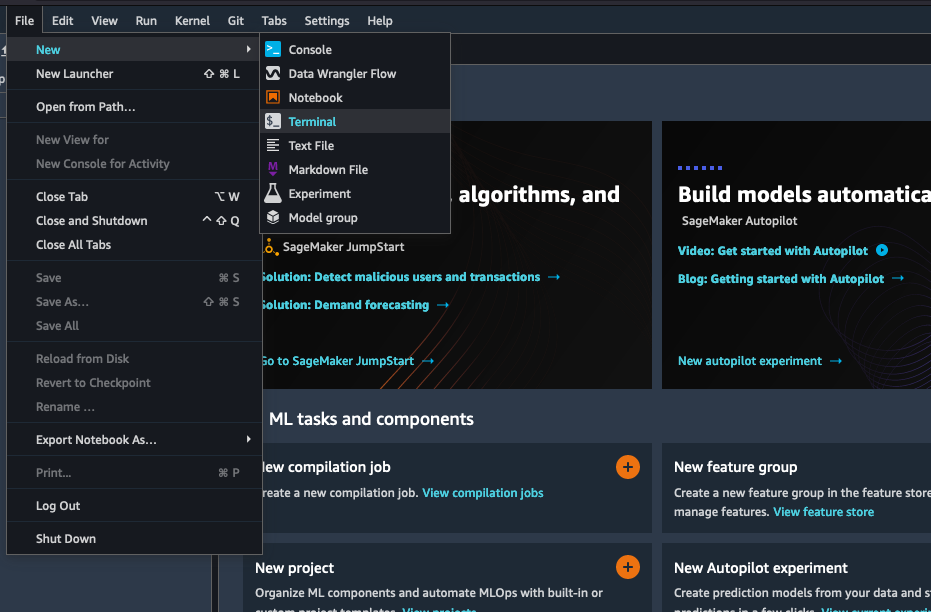
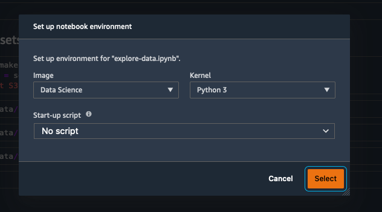
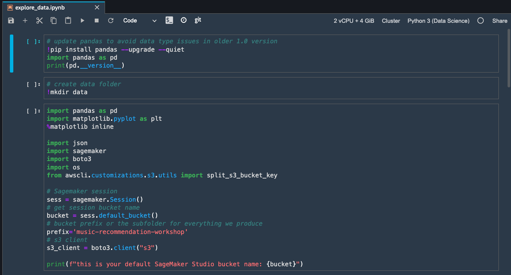
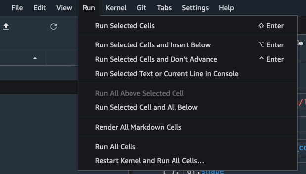
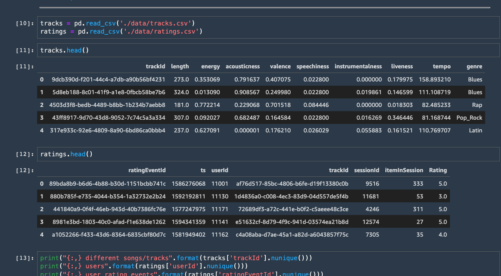
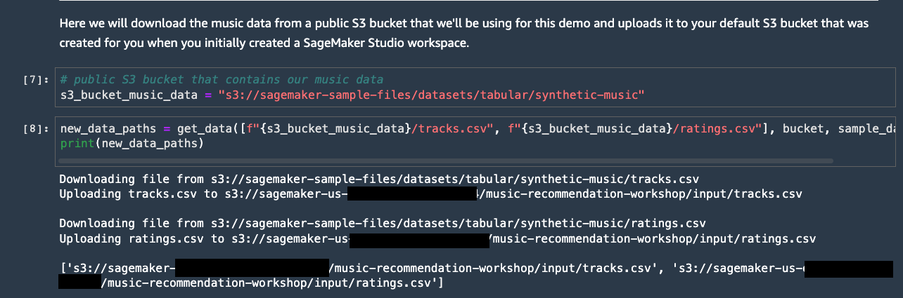

# Music Recommendation

With the rapid growth of the commercial music streaming services, more and more people nowadayas are listening to music from they model devices. However, organising, managing and searching among all the digital music produced by the society is a very time-cosuming and tedious task. Using a music recommender system to predict the user's choices and suggest songs that is likely to be interesting has been a common practice used by the music providers.

## Overview
Amazon SageMaker helps data scientists and developers to prepare, build, train, and deploy machine learning models quickly by bringing together a broad set of purpose-built capabilities. In this workshop, learn about how SageMaker can accelerate machine learning development by way of an example where we build the musical playlist tailored to a user's tastes.

## Dataset

<b>Dataset</b>

The dataset is required before we begin, ensure that you have downloaded it by following the instructions below.

Example track (track.csv) and user ratings (ratings.csv) data is provided on a publicly available S3 bucket found here: **s3://sagemaker-sample-files/datasets/tabular/synthetic-music**
We'll be running a notebook to download the data in the demo so no need to manually download it from here just yet.

**tracks.csv**  

| **Column name**       | **Description**     | 
| :------------- | :---------- | 
|`trackId`| unique identifier for each song/track |
|`length`| song length in seconds (numerical)|
|`energy`| Energy is a measure from 0.0 to 1.0 and represents a perceptual measure of intensity and activity (numerical)|
|`acousticness`| A confidence measure from 0.0 to 1.0 of whether the track is acoustic. (numerical)|
|`valence`| A measure from 0.0 to 1.0 describing the musical positiveness conveyed by a track. (numerical)|
|`speechiness`| Speechiness detects the presence of spoken words in a track. (numerical)|
|`instrumentalness`| Predicts whether a track contains no vocals. (numerical)|
|`liveness`| Detects the presence of an audience in the recording. (numerical)|
|`tempo`| The overall estimated tempo of a track in beats per minute (BPM). (numerical)|
|`genre`| The genre of the song. For example, pop, rock etc. (categorical) |

**ratings.csv**  

| **Column name**       | **Description**     | 
| :------------- | :---------- | 
|`ratingEventId`| unique identifier for each rating |
|`ts`| timestamp of rating event (datetime in seconds since 1970)|
|`userId`| unique id for each user |
|`trackId`| unique id for each song/track |
|`sessionId`| unique id for the user's session |
|`Rating`| user's rating of song on scale from 1 to 5 |

For this workshop, we'll be using our own generated track and user ratings data, but publicly available datasets/apis such as the [Million Song Dataset](http://millionsongdataset.com/) and open-source song ratings APIs are available for personal research purposes. A full end-to-end pipeline can be found in this [SageMaker example](https://github.com/aws/amazon-sagemaker-examples/tree/main/end_to_end/music_recommendation).

## Experiment:

`SageMaker DataWrangler` for exploratory data analysis (EDA) of feature columns and joining different data sources.

`SageMaker Autopilot` to train and tune an optimal regression model.

## Pre-requisites:

  * We need to ensure dataset (loan default prediction) for ML is uploaded to a data source. 
  * Data source can be any one of the following options:
       * S3
       * Athena
       * RedShift
       * SnowFlake
       
       

<b>Data Source</b>

For this experiment the Data Source will be [Amazon S3](https://aws.amazon.com/s3/)

### Downloading the dataset, and notebooks

* Ensure that you have a working Amazon SageMaker Studio environment and that it has been updated. If you do not, follow the instructions [here](https://catalog.us-east-1.prod.workshops.aws/workshops/f560a788-af64-4e5a-a02c-a6c88516ab02/en-US/introduction/setup-sagemaker).
* Open an Amazon SageMaker Studio terminal to import the datasets and notebook into Amazon SageMaker Studio
    * Select **File / New / Terminal** from the menu at the top of Amazon SageMaker Studio.
    
* Next, download the dataset to SageMaker Studio notebook using the commands below.
    * Start with the downloaded [explore-dataset.ipynb](https://github.com/melanie531/LCNC-media-workshop-temp/blob/main/explore_data.ipynb) SageMaker Studio notebook.
        * Explore the dataset locally by running the cells in the notebook.
        * Upload the datasets (CSV files) to an S3 location for consumption by SageMaker Data Wrangler later.
        * Copy the S3 URLs of the tracks and ratings data files to your clipboard. We will use these URLs later to import these part files into Data Wrangler and join them.
    * Let's run though each of the steps above.
* From the terminal run the following commands:
* **TODO** fill the commands to download the workshop contents

* Notice the file explorer on the right has been updated with a new folder called lcnc. Double click on the folder and double click on the folder music.
* Double click on the file called explore-data.ipynb. Amazon SageMaker may prompt you to select a kernel and image. If it does select Data Science as the image and Python 3 as the Kernel, as shown here:

* You have now successfully downloaded the data and opened a notebook, we will now upload the data to your S3 bucket. Note: An Amazon S3 bucket was created for you when the Amazon SageMaker Studio environment was started.

* From the menu select **Run / Run All Cells** to execute all the cells in the notebook.

* Examine the results, as you can see the samples of the data are printed to the screen.

* The data structure is defined in the next section. However, before we continue, note the path to the various datasets. Your paths will be different to the ones in the image below. Please copy these paths as you will use them later. An example of a path is s3://sagemaker-eu-west-1-112233445566/music-recommendation-workshop/input/tracks.csv

In the next section we will import the datasets into Data Wrangler via the SageMaker Studio User Interface (UI).
