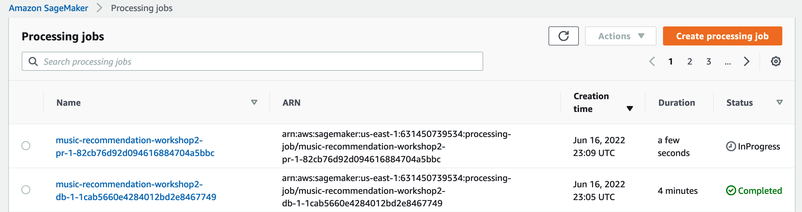

# Part 1 - SageMaker Autopilot

## Creating an Autopilot Experiment

* SageMaker Autopilot automatically creates feature engineering pipelines, selects algorithms suitable for the machine learning problem type, trains and tunes several candidate models, before arriving at an optimal model.
* Steps carried out by Autopilot are as follows:

    * <em>Automatic data pre-processing and feature engineering</em>
        * Automatically handles missing data.
        * Provides statistical insights about columns in your dataset.
        * Automatically extracts information from non-numeric columns, such as date and time information from timestamps.
        * Automatically handles imbalance in data.
        * Automatically creates 10 feature engineering (FE) pipelines most adapted to your problem. Those FE pipelines consist of FE transformations coming from both native scikit-learn, and [custom](https://github.com/aws/sagemaker-scikit-learn-extension) scikit-learn-compatible FE transformations invented and open-sourced by Amazon.

    * <em>Automatic ML model selection</em>
        * Automatically infers the type of predictions that best suit your data, such as [binary classification](https://docs.aws.amazon.com/machine-learning/latest/dg/binary-classification.html), [multi-class classification](https://docs.aws.amazon.com/machine-learning/latest/dg/multiclass-classification.html), or [regression](https://docs.aws.amazon.com/machine-learning/latest/dg/regression.html).
        * [Explores high-performing algorithms](https://aws.amazon.com/blogs/aws/amazon-sagemaker-autopilot-fully-managed-automatic-machine-learning/) such as gradient boosting decision tree, feed-forward deep neural networks, and logistic regression, and trains and optimizes hundreds of models based on these algorithms to find the model that best fits your data.
        * Automatically cross validates the data to flag problems like over-fitting or selection bias and gives insights on how the model will generalize to an independent dataset.

    * <em>Automatic Model HPO</em>
        * Runs epsilon-greedy bandit tests for each of the FE pipelines, and progressively invests more HPO budget on the most rewarding FE pipeline.

    * <em>Model leader-board</em>
        * Automatically ranks the candidate models based on user provided success metric such as accuracy, precision, recall, or area under the curve (AUC).
        * Lets user automatically deploy the model for real-time inference that is best suited to their use case.

    * <em>Explainability</em>
        * Automatic notebook generation showcasing the various candidates (pipelines) for feature engineering.
    
    * <em>Automatic notebook generation for exploratory data analysis.</em>
        * Uses SageMaker Clarify under the covers to provide model agnostic feature attribution metrics using [SHAPley values](https://docs.aws.amazon.com/sagemaker/latest/dg/clarify-shapley-values.html).

    * <em>Automatic data and model provenance</em>
        * Uses SageMaker Experiments behind the scenes to automatically capture data and model lineage for each of the candidate models trained during the process.

* To create an auto-pilot experiment, we will be using the transformed dataset that we saved in the final step of Demo 1 using Data Wrangler into S3.
* First, from the studio launcher, click on the + button for <em>New Autopilot experiment.</em>

* For the experiment settings, enter details as depicted below.

* For input location, let us re-use the output location of the exported Data Wrangler dataset generated in the previous section.
* For output location of the autopilot experiment where autopilot will store the trained models and other artifacts, let us specify the same location as the input.
* Set the Target column; in our case it is "rating".

* Open the advanced sections and complete the values as shown in the diagram below.

* You can tag an Autopilot experiment with key value pairs of information.
* You can either set the problem type yourself (Regression) or set it to Auto to let autopilot automatically identify the problem type based on the provided dataset.
* Once we populate all the values, let us hit Create Experiment to kickoff the autopilot experiment.
* Confirm that you want to deploy the best model as a SageMaker endpoint for real-time inference (shown below).

* Once we launch the experiment, we are taken to a newer interface (as shown below) to show the status of the different phases of the autopilot experiment.

* The experiment starts with the Pre-processing stage (shown below).

* At this stage, autopilot kicks off a processing job for validating and split the dataset.
* You can go to the SageMaker AWS console and under processing you can see this job.

* You can also go to the CloudWatch logs of this processing job to get an high-level understanding of what are the different steps that are being executed by Autopilot via this processing job.
* To know more about SageMaker Processing jobs. Take a look at this [resource](https://sagemaker.readthedocs.io/en/stable/amazon_sagemaker_processing.html).

* Once the 1st processing job is complete, Autopilot enters the candidates generation stage, where it runs another processing job.
* This processing job creates the different blueprints or recipes for the feature engineering as candidate pipelines.

* The CloudWatch logs of the 2nd processing jobs shows Autopilot creating the different feature engineering candidate pipelines.

* Once the candidates are generated, you can see two buttons enabled in the Autopilot experiment window.
    * Open candidate generation notebook
    * Open data exploration notebook

* You can download the notebooks too:
    * [candidate generation notebook](./notebooks/SageMakerAutopilotCandidateDefinitionNotebook.ipynb).
    * [data exploration notebook](./notebooks/SageMakerAutopilotDataExplorationNotebook.ipynb).

* In the next stage - Feature Engineering, Autopilot runs these feature engineering pipelines via SageMaker Training jobs.

* Navigate to SageMaker console and under training, you should be able to see the 10 feature engineering pipelines that are being executed by Autopilot.

* Once the feature engineering stage is completed. In the next stage - Model Tuning, Autopilot executes up to 250 training jobs. These jobs are created by combining a candidate feature engineering pipeline with a selected algorithm and set of hyper-parameters to tune.
* See the candidate generation notebook in the repo to read through the feature engineering, algorithm selection and hyperparameter selection in detail.

* In the SageMaker console, you can see the hyperparameter tuning job and the 250 training jobs that it kicks off.

* Every SageMaker training job is tracked as an Autopilot trial and ranked as per the objective metric (in this case accuracy) which we selected at the start of the experiment. The best model is at shown at the top (see image below). At the end of the Model Tuning phase, we should be able to see all of the 250 training jobs that was run and the obtained metric value.
* Once the Tuning stage is complete, the best model is deployed as a SageMaker endpoint. We enabled this option at the start when we defined the configs for the Autopilot experiment.

* From the SageMaker console, you can see the deployed endpoint in service.

* At the last stage, Autopilot generates explainability report generated via [Amazon SageMaker Clarify](https://aws.amazon.com/sagemaker/clarify/), making it easier to understand and explain how the models make predictions. Explainability reports include feature importance values so you can understand how each attribute in your training data contributes to the predicted result as a percentage. The higher the percentage, the more strongly that feature impacts your model’s predictions. You can download the explainability report as a human readable file, view model properties including feature importance in SageMaker Studio, or access feature importance using the [SageMaker Autopilot APIs](https://docs.aws.amazon.com/sagemaker/latest/dg/autopilot-reference.html).

* After all the stages are completed, the UI looks as shown in the figure below.

* You can also get to the previously run autopilot run experiments via the Experiments and trials option under SageMaker resources. Click on the triangle icon as pointed by the red arrow and choose Experiments and trials.
* Under experiments, choose the last run Autopilot experiment (pointed by the yellow arrow).

* To get to the results of the best optimal model, right click on the best model and choose Open in model details as shown below.

* The results can be viewed in three tabs - Model explainability, Artifacts and Network.
* As you can see, MLP (todo) was the winning algorithm for the best model and the screenshot below shows model explainability (Feature Importance) results for the best model. Explainability results are only provided for the optimal model.

* You can also view all the artifacts and where they are persisted under the Artifacts tab.

* For models other than the best, you can view the following information.

    > **_NOTE:_**
Explainability results are not shown for the secondary (non-winning) models.

* To get to the deployed endpoint details for the best model, Click on the SageMaker resources icon, choose Endpoints and pick the endpoint that was deployed.

