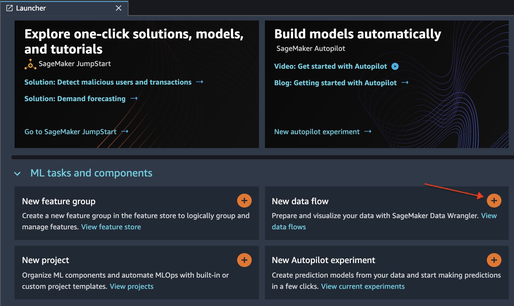
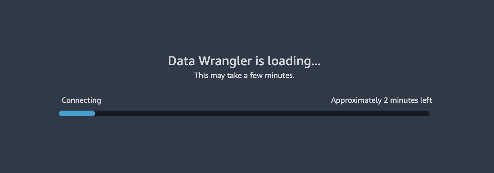
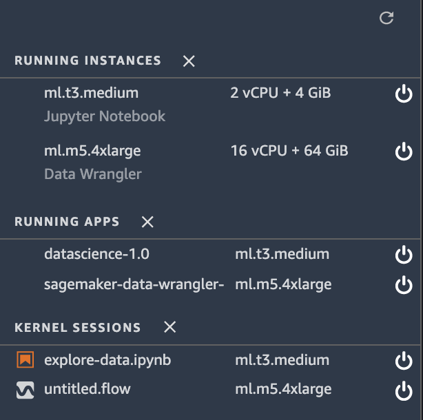
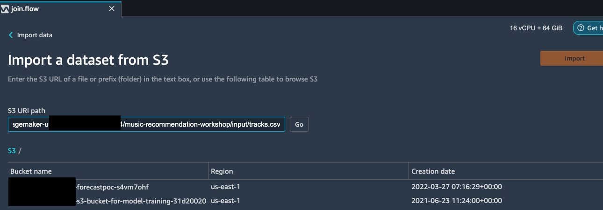
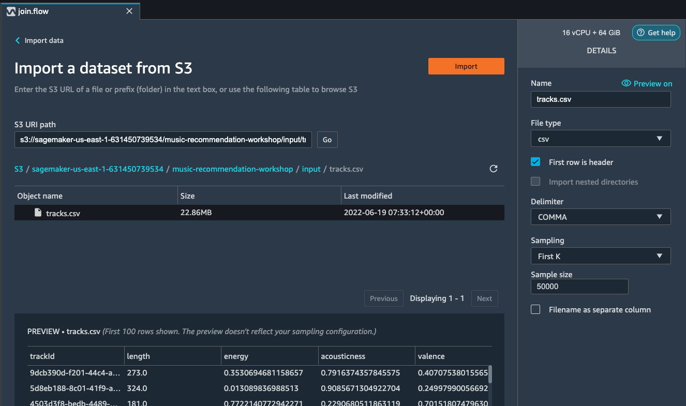
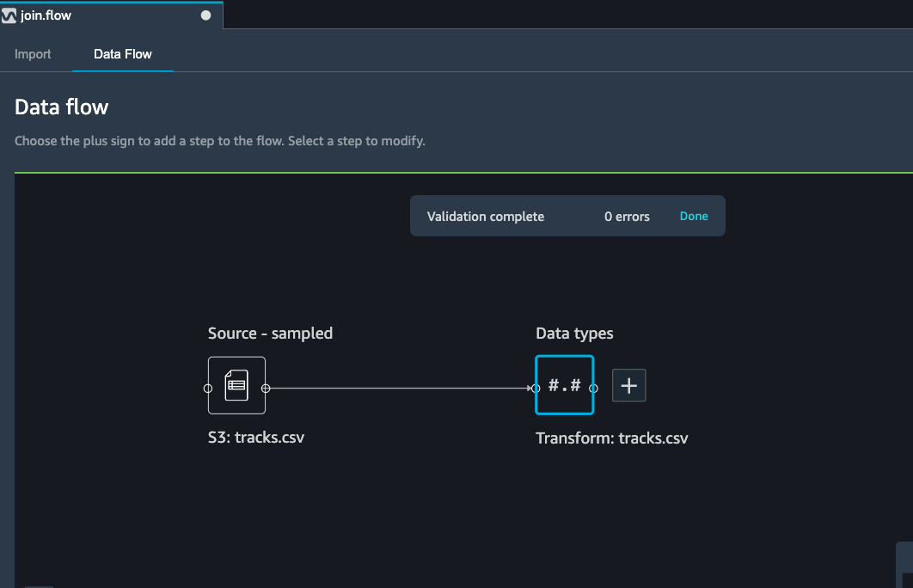

# Part 1 - Data Wrangler

## Importing datasets from a data source (S3) to Data Wrangler

* Initialize SageMaker Data Wrangler via SageMaker Studio UI.
    * There are two ways that you can do this, either from the Launcher screen as depicted here:
    
    * Or from the SageMaker resources menu on the left, selecting Data Wrangler, and new flow
    
    
* It takes a few minutes to load.

* Once Data Wrangler is loaded, you should be able to see it under running instances and apps as shown below.

* Next, make sure you have copied the data paths from the previous section, as you will need them in this section.
* Once Data Wrangler is up and running, you can see the following data flow interface with options for import, creating data flows and export as shown below.

* Make sure to rename the untitled.flow to your preference (for e.g., join.flow)
* Paste the S3 URL for the tracks.csv file into the search box below and hit go.

* Select the CSV file from the drop down results. On the right pane, make sure COMMA is chosen as the delimiter and Sampling is `First K` with Sample Size equal to `50000`. Hit `import` to import this dataset to Data Wrangler.

* Repeat the same step to import the ratings.csv file into Data Wrangler.
* Once the dataset is imported, the Data flow interface looks as shown below.
