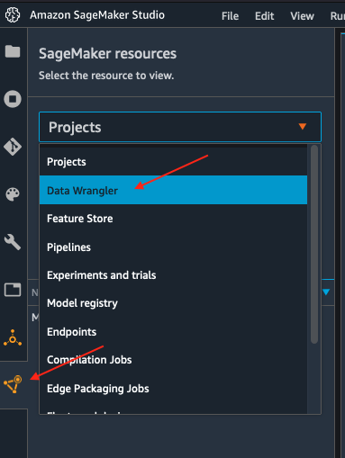

# Part 1 - Data Wrangler

## Importing datasets from a data source (S3) to Data Wrangler

* Initialize SageMaker Data Wrangler via SageMaker Studio UI.
    * There are two ways that you can do this, either from the Launcher screen as depicted here:
    
    * Or from the SageMaker resources menu on the left, selecting Data Wrangler, and new flow
    
    
* It takes a few minutes to load.

* Once Data Wrangler is loaded, you should be able to see it under running instances and apps as shown below.

* Next, make sure you have copied the data paths from the previous section, as you will need them in this section.
* Once Data Wrangler is up and running, you can see the following data flow interface with options for import, creating data flows and export as shown below.

* Make sure to rename the untitled.flow to your preference (for e.g., join.flow)
* Paste the S3 URL for the tracks.csv file into the search box below and hit go.

* Select the CSV file from the drop down results. On the right pane, make sure COMMA is chosen as the delimiter and Sampling is *None*. Hit *import* to import this dataset to Data Wrangler.

* Once the dataset is imported, the Data flow interface looks as shown below.

* Since currently you are in the data flow tab, hit the import tab (left of data flow tab) as seen in the above image.
* Import the second part file (ratings.csv) following the same set of instructions as noted previously.


### Transform tracks dataset
* We firstly want to perform some data transformation using Data Wrangler. Let us walkthough how to perform different transformations using built-in and custom formula functionality in Data Wrangler. 
    * As the *genre* column in the tracks dataset is a categorical feature, we need to perform one-hot encoding to trasform this feature. 
    * Click on the tracks file transform block as show in the image below and select **Add transform**:
    
    * This takes us to the Data Wrangler transformations interface where there are over 300+ transformations you can apply to your dataset. Select **Add step** as shown below.
    
    * In the **ADD TRANFORM** window, double click the option **Encode categorical**.
    
    * Then on the **ENCODE CATEGORICAL** window, choose *One-hot encode* as the Transform type, *genre* as the input columns, and *Columns* as the output style. Click *Preview* and the output is shown as below:
    
    * Click **Add** to add the tranform step to the flow. If you go back to the *Data Flow*, you can see the step has been added.
    
    
* We also want to generate a new feature based on the danceability of the track. Danceability describes how suitable a track is for dancing based on a combination of musical elements including tempo, rhythm stability, beat strength, and overall regularity.
    * Click on the newly added **One-hot encode** step and select *Add transformation*:
    
    * Select **Add step** and choose **Custom formula**.
    
    * Copy and paste below formula and put **danceability** to the *Output Column*.
   
    <code>0.3\*valence + 0.1\*liveness + 0.1\*energy</code>
    
    

    * Click **Preview** and **Add** the step to the flow.
    

### Joining datasets - first join
* Given, we have imported both the tracks and ratings CSV files in the beginning steps. Let us walk through on how to join these CSV files based on a common unique identifier column, *trackId*. 
* Click on either the tracks or ratings transform block as shown in the image blow:
    * Here, we have selected tracks transform flow block and hit **Join**
    
    * Select the other rating file transform block and it automatically maps (converges) both the files into a Join preview as shown below.
    <div class="alert alert-block alert-info">
    <b>Note</b>

    Files can also be concatenated similar to join operations

    </div>
    
    * Hit configure.
    
    * Here, choose a name for the resulting join file and choose the type of join and columns on to join.
    
    * Hit **Apply** (*Preview*) . You can see a preview of the Joined dataset as shown in the image below.
    
    <div class="alert alert-block alert-info">
    <b>Note</b>

    Depending on the version of SageMaker it might be Preview and not Add

    </div>
    
    * Hit *Add* at the upper right corner to add this Join transform to the original data flow.
    * At the end of this step, the data flow looks as shown below.
    
    
    * Next step, let's see how to use Data Wrangler to add custom transform to perform more advanced feature engineering. Here, we want to use pyspark to calculate averages of 5-star ratings and use them as new features.
    * Select on the jointrackid.csv block and click the + icon, under which click on Add transform.
    
    * Click the custom transform at this step.
    
    * Give a name to this custom transform step and copy and paste below custom script to the window.
    
```python
# Table is available as variable `df`
import pyspark.sql.functions as F
# numeric features
num_feat_cols = ['energy', 'acousticness', 'valence', 'speechiness', 'instrumentalness', 'liveness', 'tempo', 'danceability', 'genre_Latin', 'genre_Folk',  'genre_Blues', 'genre_Rap', 'genre_Reggae', 'genre_Jazz', 'genre_RnB', 'genre_Country', 'genre_Electronic', 'genre_Pop_Rock']
# calculate averages for 5-star ratings
agg_obj = [F.avg(feat_col).alias(feat_col+"_5star") for feat_col in num_feat_cols]
df = df.filter(F.col('Rating')==5).groupBy('userId').agg(*agg_obj)
```
* 
    
    * Click *Preview* and the *Add* this step to the flow.
    
* We want to join the generated new features back to the original data. Before joining back, we notice some columns in the joint dataset are not needed for the model training, such as the id related columns. Let’s see now how to add a simple transform using Data Wrangler to drop the columns after the JOIN operation we did previously.
    * Select the jointrackid.csv block and select *Add transform*.
    
    * Let us apply the manage columns transform to drop some columns listed as below
        * *trackId_0*
        * *trackId_1*
        * *ts* 
        * *sessionId*
        * *itemInSession*
        * *ratingEventId*
    
    
    * we can drop multiple columns by selecting each column from the drop down manual.
    
    
    * Once all the columns are selected, hit **Preview** first and then **Add**. 
    
    
    * Now go back to data flow.
    * You should now be able to see the 2 transforms (custom transform and dropping the columns) as shown below in the Data Flow interface.
    
    
    * Next step is to join the two dataset back together. Similarly as the first join, we select one block and choose *Join*.
    
    * Select the other file transform block and get a Join preview.
    
    * Fill in the step Name, Join Type and columns to join on (*UserId*).
    
    * Preview and Add this step to the flow file. When we go back to the data flow, this is how the flow looks like now.
    
    

## Export transformed features to S3 (will be consumed by SageMaker Autopilot)

* To export the transformed dataset, first click on the + symbol and choose Add Destination, followed by Amazon S3 as pointed out by the screen shot below.


* A new window is opened, Click Export data, choose the S3 location where you want to save the transformed dataset.

* A job is needed to export the data to Amazon S3, to do this press the Create Job button on the top right, this will open a window.

* Set the Job name to something like generate-train-test-data


* Hit the **Configure Job** button at the bottom

* Leave the default instance type, and press the Run button at the bottom.

* Note that your job has been created successfully and if you want to see the progress of the job you can do so by following the link to the generate-train-test-data process.

* Follow the link to see the status of your job.

* When the job is complete a new file will be available in your S3 bucket in the output folder.

### *Other ways to export the transformations and analysis*

* The join.flow file that we created initially captures all of the transformations, joins and analysis.
* In a way, this file allows us to capture and persist every step of our feature engineering journey into a static file.
* The flow file can then be used to re-create the analysis and feature engineering steps via Data Wrangler. All you need to do is import the flow file to SageMaker Studio and click on it.
* We saw previously, how to export transformed dataset into S3. Additionally, we can also export the analysis and transformations in many other formats.
* To start exporting, click on the train Dataset data block and click on the + icon and select **Export to**.

* You can export the analysis and transforms in 4 different ways in addition to direct export to S3 which we saw previously.
    * Save to S3 as a SageMaker Processing job notebook.
    * Export as a SageMaker Pipeline notebook.
    * Export as a Python script.
    * Export to SageMaker Feature Store as a notebook.

### *Run Autopilot training directly from Data Wrangler flow*


